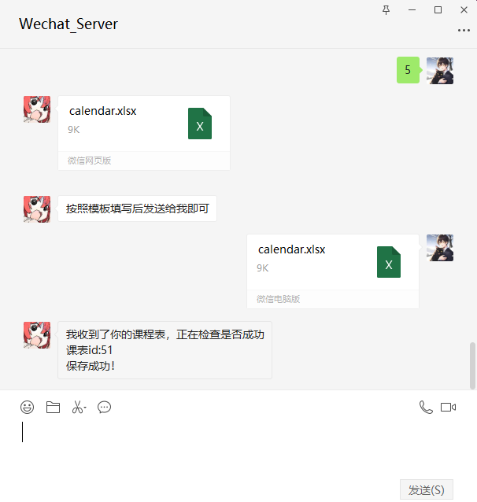
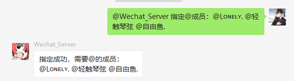

# wechat_calendar
一个基于个人微信的日程课程表，定时任务推送
<<<<<<< HEAD
## 包括但限于课程表和定时提醒任务推送，登录个人微信后即可创建定时任务等
=======
## 主要功能

### 1、课程表推送：
   
**这一步要注意格式，不要填错了**  
    通过监听用户发送的excel文件保存到数据库中，对bot发送数字**5**即可获取模板文件
    填写完成后可以直接发送给bot，bot会自动解析文件，
    然后会通过上传文件的时间周作为第一周的时间，后面的周数判断都从这里判断  
   
   
    之后可以发送 **查询** 命令查询课程信息，**默认查询的是当天的课程表**，如果需要查询指定星期几的课程，需要输入：**查询：6** 代表查询星期六课程

   .png)

   #### 上课提醒，提前十五分钟提醒
   

   #### 下课提醒，默认提前一分钟提醒
   

   #### 删除或修改课程表,如需修改则需要先删除然后重新发送新课程表文件
   

### 2、定时任务模块
**指令范围1-4**分别对应增删改查
#### ①创建定时任务
   
   
#### ②删除定时任务
   
#### 更新和查询这里就不再赘述，大致一样
## 3、有道翻译
### 发送翻译或有道即可进入翻译模式，推出输入quit
   
## 4、网易云点歌
   
## 5、AI绘画mj绘画
   
## 6、chatgpt聊天,并且支持上下文，每个用户之间独立
   
## 7、英文阅读生成
       
## 如果定时任务和课程对象是群聊则可以指定@的群成员
   
   

# 未来会加入的功能：
- 背单词
# 部署教程
目前只试过本地部署
首先配置根目录下的 **config.json** 文件然后填写对应的配置，如果有不需要的功能直接填空就可以  
**必须项** ：
- **mysql数据库
安装完成后在根目录下找到wechat_server.sql文件，然后找一个数据库管理软件，执行sql文件，或全复制到命令行**

## 本项目支持多用户，课程和任务都可以，相互之间不冲突
然后运行 **ReadWechatMsg.py** 然后缺什么依赖就  
`
pip install [依赖名]  
`  
代码无报错就会在根目录下生成 **QR.jpg** 图片二维码，打开图片进行扫码，就可以开始使用了

   

     

>>>>>>> b8014cf (提交信息)
